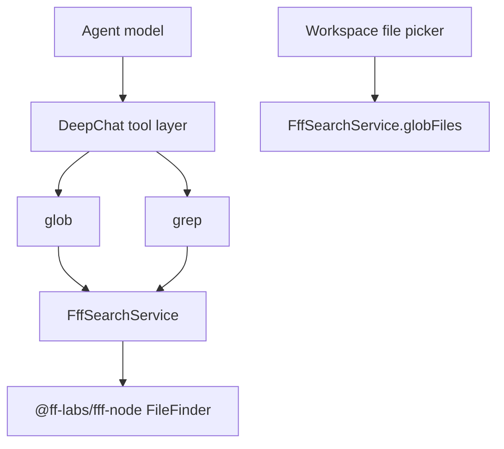

# Agent FFF Node API Search Plan

## Architecture



The model never receives FFF binding details and never receives shell-search guidance.
DeepChat-owned code no longer spawns or injects bundled ripgrep.

## Implementation Steps

1. Add FFF Node dependency.
   - Add `@ff-labs/fff-node`.
   - Keep the import isolated behind `FffSearchService` so native load errors become typed
     `FffSearchUnavailableError` failures.

2. Build `FffSearchService`.
   - Cache one `FileFinder` per workspace root.
   - Wait for the initial scan before serving requests.
   - Support `AbortSignal` during scan waits and before each search call.
   - Implement:
     - `findFiles(query, options)` with `fileSearch`
     - `grep(query, options)` with `grep`, regex-like query detection, and full snippet hydration
     - `globFiles(pattern, options)` with `glob`
   - Normalize output to JSON-safe `{ path, score }` and
     `{ path, lineNumber, snippet, score }`.

3. Add agent tool handler.
   - Validate arguments with zod.
   - Enforce path scope permissions with `AgentFileSystemHandler`.
   - Return JSON arrays and `source: "fff"` metadata.
   - Do not catch FFF unavailable errors for fallback.

4. Integrate with `AgentToolManager`.
   - Register schemas and tool definitions for `glob` and `grep`.
   - Route tool calls through `AgentFffSearchHandler`.
   - Map legacy skill/search names to the FFF tools.
   - Update read-permission target collection for `pathScope`.
   - Clean legacy persisted disabled-tool `grep` values so old settings do not disable the new
     FFF-backed `grep` tool.

5. Update prompts.
   - Search order: `glob -> grep -> read`.
   - Forbid shell search commands and command generation for code search.
   - Remove positive recommendations for `rg`, shell `grep`, `find`, `fd`, and `ls` as search tools.

6. Remove ripgrep fallback and runtime injection.
   - Delete `FffRipgrepFallback`.
   - Delete legacy `runRipgrepSearch`.
   - Remove ripgrep path discovery from `RuntimeHelper`.
   - Remove ripgrep from bundled PATH construction.
   - Remove `rg` command replacement from `replaceWithRuntimeCommand`.
   - Remove `tiny-runtime-injector --type ripgrep` from all runtime install scripts.

7. Move workspace file picker search to FFF.
   - Replace `RipgrepSearcher.files()` with `FffSearchService.globFiles()`.
   - Keep default directory exclusions in TypeScript.
   - Delete `ripgrepSearcher.ts`.

8. Keep packaged native loading compatible with macOS signing.
   - Add `asarUnpack` entries for `@ff-labs/fff-node`, `@ff-labs/fff-bin-*`, `ffi-rs`, and
     `@yuuang/ffi-rs-*`.
   - In `afterPack`, copy the target `@ff-labs/fff-bin-*` package into unpacked node_modules when
     Electron Builder misses the transitive optional dependency under pnpm.
   - Let the existing Electron Builder mac signing flow sign unpacked native files inside
     `Contents/Resources/app.asar.unpacked`.
   - Do not add a runtime `rg` fallback or manual shell search path.

## Prompt Template

```text
Use structured file search tools for codebase navigation.

Search order:
1. Call glob when you need candidate file paths.
2. Call grep when you need content matches, optionally scoped to candidate paths.
3. Call read only after search has identified files worth opening.

Do not call shell commands for search. Do not generate rg, shell grep, find, fd, or ls commands, and do not use exec for code search.
Return and consume search results as JSON objects with path, lineNumber, snippet, and score fields.
```

## Testing Plan

- Unit test `FffSearchService`:
  - file search mapping
  - grep mapping and context snippets
  - glob mapping
  - initial scan timeout
  - abort during initial scan
- Unit test `AgentFffSearchHandler`:
  - JSON output shape
  - unavailable FFF error without fallback
  - path scope permission rejection
  - argument validation
- Unit test `AgentToolManager`:
  - tool definitions expose both FFF-backed search tools
  - `glob` and `grep` return visible JSON and raw metadata
- Unit test prompt/mapping:
  - prompt includes FFF search guidance
  - prompt does not recommend shell search
  - legacy aliases resolve to FFF tools
- Unit test workspace search:
  - uses FFF glob search
  - preserves default excludes
- Runtime helper tests:
  - bundled runtime PATH no longer includes ripgrep
  - `rg` is not mapped to a bundled runtime command
- Build config tests:
  - FFF and `ffi-rs` native dependency packages are explicitly listed in `asarUnpack`

## Validation Commands

```bash
pnpm run format
pnpm run i18n
pnpm run lint
pnpm run typecheck
pnpm exec vitest run --project main \
  test/main/build/electronBuilderConfig.test.ts \
  test/main/lib/agentRuntime/fffSearchService.test.ts \
  test/main/lib/runtimeHelper.test.ts \
  test/main/presenter/workspacePresenter/fileSearcher.test.ts \
  test/main/presenter/toolPresenter/agentTools/agentFffSearchHandler.test.ts \
  test/main/presenter/toolPresenter/agentTools/agentToolManagerFffSearch.test.ts \
  test/main/presenter/toolPresenter/toolPresenter.test.ts \
  test/main/presenter/skillPresenter/toolNameMapping.test.ts \
  test/main/scripts/afterPack.test.ts
pnpm exec electron-builder --dir --mac --arm64 -c.mac.identity=- -c.publish=never
```

Full `pnpm test` should be run when possible, but this branch may inherit unrelated existing test
failures from the repository.

## Risk Notes

- FFF native loading can fail on unsupported or improperly signed platforms. This is surfaced as a
  tool error instead of falling back to shell search.
- macOS packaging needs the FFF/`ffi-rs` native dependency chain unpacked from ASAR so the existing
  codesign/notarization flow sees real `.node` and `.dylib` files.
- mac x64 and arm64 builds require the matching optional `@ff-labs/fff-bin-darwin-*` package to be
  installed on the packaging host; `afterPack` fails early if the target package is missing instead
  of shipping a broken native loader.
- FFF warm repeated searches should outperform repeated process-based search. Cold startup can
  include indexing cost.
- Removing bundled ripgrep install means any user shell command named `rg` will use the user's own
  PATH, not a DeepChat-provided binary.
