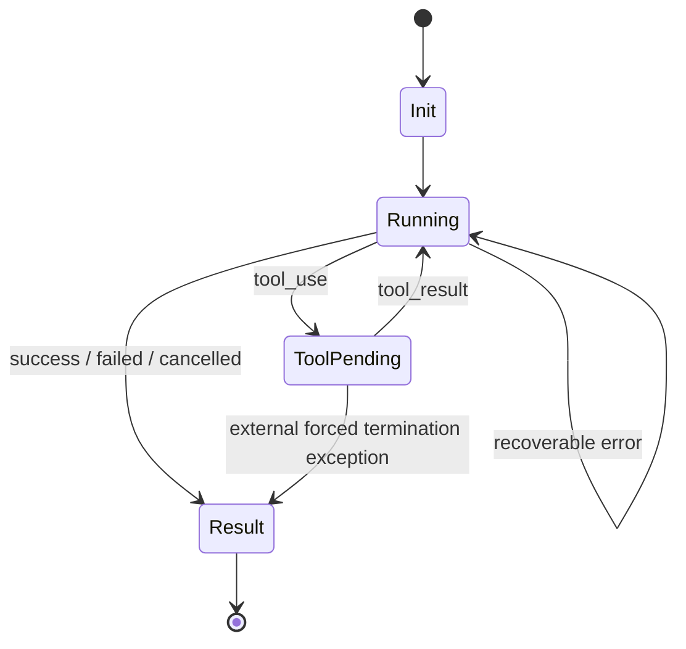

# Jiaorong CLI v1 机器协议规范

> 状态：Active implementation contract
> 协议主版本：1
> 关联：[产品需求文档](./jiaorong-cli-v1-prd.md) · [一致性测试矩阵](./jiaorong-cli-v1-conformance-matrix.md) · [领域词汇表](../CONTEXT.md)

## 1. 适用范围

本规范定义 Jiaorong CLI v1 的非交互调用、机器输出、事件顺序、会话、工具、错误和取消合同。它不定义交互式 TUI、后台任务、ACP、MCP 或桌面客户端协议。

本协议是 Jiaorong CLI 自己的公开合同。调用者只能依赖本文定义的参数、事件、错误和兼容规则。

## 2. 传输约定

### 2.1 进程

- 一次 Headless Run 对应一个前台操作系统进程。
- stdout 是结果协议通道。
- stderr 是诊断通道。
- 编码固定为 UTF-8。
- `stream-json` 使用 JSON Lines：一行一个完整 JSON 对象，以 `\n` 结束。
- stdout 不允许输出 banner、升级提示、进度条、ANSI 控制符或调试日志。
- 协议事件不得跨行格式化。

### 2.2 Prompt 输入

参数输入：

```bash
jiaorong-cli -p "Summarize the project" --output-format stream-json
```

stdin 输入：

```bash
printf '%s' 'Summarize the project' | jiaorong-cli --output-format stream-json
```

规则：

- `-p/--prompt` 和非空 stdin 只能二选一。
- Prompt 为空返回 `INVALID_ARGUMENT` 和 exit 42。
- Prompt 按 UTF-8 文本处理，不作为 shell 命令拼接。
- CLI 参数必须通过 argv 解析，不允许先拼成 shell 字符串再执行。

### 2.3 新建和恢复会话

新建：

```bash
jiaorong-cli -p "Inspect this vault" --output-format stream-json
```

恢复：

```bash
jiaorong-cli -p "Continue" --resume ses_01J... --output-format stream-json
```

- 新建会话的 Session ID 由 JiaorongAI 生成并由 CLI 返回。
- `--resume` 不允许与调用方自定义新 Session ID 的参数并存。
- Session 不存在、已删除或不属于当前账号时返回 `INVALID_ARGUMENT` 和 exit 42，不创建同名新会话。
- App Backend 允许不同 Session 并发运行。每个 Session 同一时刻只允许一个活动 Headless Run；第二个并发运行必须在调用第二次 `chat.sendMessage` 前返回 `INVALID_ARGUMENT` 和 exit 42。
- 每个运行使用独立的有界 event buffer 和不可猜测的 run token。buffer 只接收本 Session 的事件；清理只能按本 run token 释放自己的监听器和 Session 锁。

## 3. 输出模式

### 3.1 text

成功时 stdout 只包含最终 Assistant 正文：

```text
The project is an Obsidian Agent integration.
```

失败时 stdout 为空，stderr 可显示面向人的错误，exit code 非 0。

### 3.2 json

stdout 只输出一个 JSON 对象：

```json
{
  "protocolVersion": 1,
  "requestId": "req_01JABC",
  "sessionId": "ses_01JXYZ",
  "status": "success",
  "content": "The project is an Obsidian Agent integration.",
  "model": {
    "id": "jiaorong-default"
  },
  "usage": {
    "inputTokens": 1200,
    "outputTokens": 84,
    "totalTokens": 1284
  },
  "turns": 3,
  "durationMs": 4210,
  "error": null
}
```

失败时仍输出同一结果结构，`status` 为 `failed` 或 `cancelled`，并携带 `error`；进程同时返回对应非零 exit code。认证、参数、模型或 Attachment 预检失败时，`sessionId` 和 `model` 可以为 null，且不得创建 Agent Session。

### 3.3 stream-json

v1 核心事件类型为：

```text
init
message
reasoning_summary
tool_use
tool_result
error
result
```

其中 `init` 和 `result` 必须出现且各一次，`reasoning_summary` 可选，其他事件按运行需要出现。同一主版本允许增加可跳过的未知非终止事件，见第 14 节。

## 4. 通用标识

### requestId

- 每次 Headless Run 唯一。
- 在 `init` 和 `result` 中必须出现。
- 用于关联日志，但不是 Session ID。

### sessionId

- 标识持久 Agent Session。
- 新建和恢复运行都必须在 `init` 与 `result` 返回。
- 认证、参数、模型或 Attachment 预检失败时，允许 `init` 与 `result` 的 `sessionId` 为 null，且不得创建 Agent Session。
- 不得使用进程 ID 充当 Session ID。

### messageId

- 标识一条 Assistant 消息。
- 同一条消息的所有 `message` 增量使用相同 ID。

### toolCallId

- 标识一次工具调用。
- `tool_use` 与其 `tool_result` 必须使用相同 ID。
- 同一 Headless Run 内不得复用。

非 null 标识的具体格式由实现决定，但必须为非空 UTF-8 字符串，且不得包含凭据。

## 5. 事件定义

### 5.1 init

每个有效 `stream-json` Headless Run 的第一个事件，且恰好出现一次。

```json
{
  "type": "init",
  "protocolVersion": 1,
  "requestId": "req_01JABC",
  "sessionId": "ses_01JXYZ",
  "resumed": false,
  "model": {
    "id": "jiaorong-default",
    "displayName": "Jiaorong Default"
  },
  "permissionMode": "default",
  "attachments": [
    {
      "id": "att_01J123",
      "name": "diagram.png",
      "mimeType": "image/png",
      "sizeBytes": 38211
    }
  ]
}
```

必填字段：

| 字段 | 类型 | 说明 |
|---|---|---|
| `type` | `"init"` | 事件类型 |
| `protocolVersion` | integer | v1 固定为 1 |
| `requestId` | string | 本轮请求 ID |
| `sessionId` | string \| null | 新建或恢复后的 Session ID；预检失败时为 null |
| `resumed` | boolean | 是否通过 `--resume` 恢复 |
| `model` | object \| null | 实际生效模型；预检失败时为 null |
| `permissionMode` | string \| null | 实际生效权限模式；相关参数预检失败时为 null |
| `attachments` | array | 已接受附件元数据，可为空 |

`attachments` 不得包含原始二进制、完整文件正文或凭据。

认证、参数、模型或 Attachment 预检失败时仍应先输出 `init` 以建立协议，但此时 `sessionId` 和 `model` 可以为 null，且不得为了满足字段要求创建 Agent Session。成功运行的 `init.sessionId` 和 `init.model` 必须非空，且成功 `result.sessionId` 必须非空。

### 5.2 message

Assistant 可展示正文的增量事件。

```json
{
  "type": "message",
  "messageId": "msg_01J456",
  "role": "assistant",
  "delta": "The project "
}
```

规则：

- v1 的 `role` 固定为 `assistant`。
- `delta` 是追加文本，不是全量快照。
- 按事件顺序拼接同一 `messageId` 的 `delta`，得到最终正文。
- 所有 `message` 拼接结果必须等于 `result.content`。
- 不用 `message` 回显用户 prompt。

### 5.3 reasoning_summary

可选、允许展示给用户的推理摘要增量。

```json
{
  "type": "reasoning_summary",
  "messageId": "msg_01J456",
  "delta": "Checking the project structure."
}
```

规则：

- 不得包含或声称是模型原始思维链。
- 缺失该事件不属于错误。
- 不计入 `result.content`。
- 消费者可以选择不展示。

### 5.4 tool_use

Agent 开始一次工具调用。

```json
{
  "type": "tool_use",
  "toolCallId": "tool_01J789",
  "name": "read_file",
  "input": {
    "path": "README.md"
  }
}
```

规则：

- `name` 是稳定工具标识，不使用本地化展示名称。
- `input` 必须是 JSON 值，通常为 object。
- 实现必须限制序列化大小并对敏感字段脱敏。
- 发出 `tool_use` 后必须最终发出且只发出一个对应 `tool_result`，除非进程被外部强杀。

### 5.5 tool_result

工具调用的终止结果。

成功：

```json
{
  "type": "tool_result",
  "toolCallId": "tool_01J789",
  "status": "success",
  "output": {
    "summary": "Read 148 lines from README.md"
  },
  "error": null
}
```

失败：

```json
{
  "type": "tool_result",
  "toolCallId": "tool_01J790",
  "status": "failed",
  "output": null,
  "error": {
    "code": "PERMISSION_DENIED",
    "message": "File is outside the authorized directories."
  }
}
```

取消：

```json
{
  "type": "tool_result",
  "toolCallId": "tool_01J791",
  "status": "cancelled",
  "output": null,
  "error": {
    "code": "CANCELLED",
    "message": "Tool execution was cancelled."
  }
}
```

`status` 只允许：`success | failed | cancelled`。

工具失败不一定终止整个 Headless Run；Agent 可以继续执行其他安全步骤。是否最终失败由 `result` 决定。

### 5.6 error

运行级警告或错误。

```json
{
  "type": "error",
  "code": "MODEL_UNAVAILABLE",
  "message": "The selected model is temporarily unavailable.",
  "recoverable": false,
  "details": null
}
```

必填：

| 字段 | 类型 |
|---|---|
| `type` | `"error"` |
| `code` | Machine Error Code |
| `message` | string |
| `recoverable` | boolean |

规则：

- `message` 面向展示，可本地化，不是分支判断依据。
- `details` 可选，必须可 JSON 序列化且不得含凭据。
- 终止性错误之后仍必须输出 `result(status="failed")`。
- 非终止警告可输出 `recoverable: true`，但不得用 error 事件替代 tool_result。

### 5.7 result

每个有效 `stream-json` Headless Run 的最后事件，且恰好一次。

成功：

```json
{
  "type": "result",
  "requestId": "req_01JABC",
  "sessionId": "ses_01JXYZ",
  "status": "success",
  "content": "The project is an Obsidian Agent integration.",
  "usage": {
    "inputTokens": 1200,
    "outputTokens": 84,
    "totalTokens": 1284
  },
  "turns": 3,
  "durationMs": 4210,
  "error": null
}
```

失败：

```json
{
  "type": "result",
  "requestId": "req_01JABC",
  "sessionId": null,
  "status": "failed",
  "content": "",
  "usage": null,
  "turns": 0,
  "durationMs": 140,
  "error": {
    "code": "AUTH_REQUIRED",
    "message": "Open JiaorongAI and complete sign-in before retrying."
  }
}
```

取消：

```json
{
  "type": "result",
  "requestId": "req_01JABC",
  "sessionId": "ses_01JXYZ",
  "status": "cancelled",
  "content": "Partial response already emitted",
  "usage": null,
  "turns": 1,
  "durationMs": 1800,
  "error": {
    "code": "CANCELLED",
    "message": "The run was cancelled."
  }
}
```

`status` 只允许：`success | failed | cancelled`。

规则：

- `result` 之后 stdout 不得再输出任何协议事件。
- `success` 必须 exit 0、`error` 为 null，且 `sessionId` 非空。
- `failed` 必须非零退出且 `error` 非 null。
- `cancelled` 必须 exit 130 且 error code 为 `CANCELLED`。
- `content` 等于所有 Assistant `message.delta` 的顺序拼接；失败前已输出部分正文时允许保留。
- usage 不可获得时为 null，不允许伪造 0。

## 6. 事件顺序状态机



强制不变量：

1. `init` 第一个且唯一。
2. `result` 最后且唯一。
3. `tool_result` 必须引用之前存在的 `tool_use`。
4. 同一 `toolCallId` 只有一个 `tool_use` 和一个终止 `tool_result`。
5. `result` 之后不得有事件。
6. 正常、失败、超时和优雅取消都必须有 `result`。
7. 只有无法捕获的崩溃、强制杀进程或操作系统故障允许缺失 `result`；消费者将其视为 `PROTOCOL_FAILURE`，不是正常业务失败。

## 7. 权限协议

`--permission-mode`：

| 工具类别 | default | full_access |
|---|---:|---:|
| Read | 允许 | 允许 |
| Search | 允许 | 允许 |
| Edit | 需默认策略；不能自动批准则拒绝 | 允许 |
| Shell | 需默认策略；不能自动批准则拒绝 | 允许 |

- 拒绝时必须返回 `tool_result.status="failed"` 和 `PERMISSION_DENIED`。
- v1 不得在 Headless Run 中等待键盘或 stdin 审批。
- `full_access` 不取消 Project Root 和 Additional Directory 边界。

## 8. 文件与 Attachment

### 8.1 目录

- `cwd` 是 Project Root。
- `--add-dir` 可重复。
- 相对路径相对于 Project Root 解析。
- 访问前比较规范化后的 real path。
- 必须防止 `..`、symlink 和 macOS 大小写别名逃逸。

### 8.2 Attachment

```bash
jiaorong-cli -p "Compare" \
  --file ./a.md \
  --file ./diagram.png \
  --output-format stream-json
```

v1 必须支持：

- `text/plain`
- `text/markdown`
- `application/json`
- `image/png`
- `image/jpeg`
- `image/webp`
- `image/gif`

v1 限制：

- `--file` 最多 16 个；单个 Attachment 的源文件最大 30 MiB，合计最大 60 MiB。
- `--add-dir` 最多 16 个。
- 每个传入路径的 UTF-8 编码最大 4,096 bytes，且不得包含控制字符。
- 所有 Attachment 先完成存在性、可读性、大小与规范化 real path 检查，再读取允许范围内的文件以判定类型；任一失败时不得调用 JiaorongAI 准备文件或创建 Agent Session，超大小文件不得部分读取。
- macOS Finder alias 不作为可跟随的文件路径接受。

其他 MIME 可由实现增加，但在同一协议主版本中只能作为兼容扩展。无法处理的文件必须在模型调用前失败，不得静默跳过。

## 9. 模型目录协议

```bash
jiaorong-cli models list --output-format json
```

```json
{
  "schemaVersion": 1,
  "models": [
    {
      "id": "jiaorong-default",
      "displayName": "Jiaorong Default",
      "isDefault": true,
      "available": true,
      "inputTypes": ["text", "image"],
      "contextWindow": 200000
    }
  ]
}
```

- `id` 是调用参数使用的稳定 Model ID。App Backend 使用 `<URL-encoded provider-id>/<URL-encoded model-id>`，确保它唯一映射到一个 JiaorongAI provider/model pair。
- `displayName` 可变化，不得用作持久标识。
- `contextWindow` 无法提供时可省略。
- 不可用模型可以保留在列表并标记 `available: false`。

## 10. Session 范围

首版公开命令只支持新建和 `--resume`。CLI 使用 JiaorongAI 的 Session persistence，但不承诺完整 Session 列表或管理 API。

## 11. Doctor

```bash
jiaorong-cli doctor --output-format json
```

```json
{
  "ok": true,
  "cliVersion": "1.0.0",
  "protocolVersions": [1],
  "checks": [
    { "name": "app-installation", "status": "pass" },
    { "name": "app-version", "status": "pass" },
    { "name": "loopback-endpoint", "status": "pass" },
    { "name": "bridge-contract", "status": "pass" },
    { "name": "models", "status": "pass" },
    { "name": "authentication", "status": "warn" }
  ]
}
```

Doctor 必须只读。JiaorongAI 0.5.6 没有只读的凭据有效性信号时，`authentication` 必须报告 `warn`，不得通过发送测试模型请求把未知状态假报为 pass/fail。

App Backend 会在创建 Agent Session 前调用 provider connection check。0.5.6 的失败响应只有非结构化 `errorMsg`，因此 CLI 不得解析该文本推断认证或模型状态；失败统一脱敏映射为 `INTERNAL_ERROR`。只有未来经验证的结构化判别字段才可映射为 `AUTH_REQUIRED` 或其他更具体的 Machine Error Code。

## 12. 错误与退出码

### 12.1 Exit code

| Code | 含义 |
|---:|---|
| 0 | success |
| 1 | model/tool/internal failure |
| 42 | invalid input/argument/protocol |
| 53 | max turns exceeded |
| 130 | cancelled by SIGINT |

### 12.2 Machine Error Code

| Code | 默认 exit | 是否建议自动重试 |
|---|---:|---|
| `AUTH_REQUIRED` | 1 | 否 |
| `INVALID_ARGUMENT` | 42 | 否 |
| `UNSUPPORTED_PROTOCOL` | 42 | 否 |
| `MODEL_UNAVAILABLE` | 1 | 可在退避后重试 |
| `PERMISSION_DENIED` | 1 或工具级 | 否 |
| `TOOL_FAILED` | 1 或工具级 | 视工具幂等性 |
| `UNSUPPORTED_ATTACHMENT` | 42 | 否 |
| `TIMEOUT` | 1 | 由调用方决定 |
| `TURN_LIMIT` | 53 | 否 |
| `CANCELLED` | 130 | 否 |
| `INTERNAL_ERROR` | 1 | 可在退避后重试一次 |

自动重试不得仅依据表格执行；写工具可能已产生部分副作用，调用方必须结合 Tool Result 和任务幂等性。

## 13. SIGINT 取消

收到第一次 SIGINT：

1. 标记当前 Headless Run 为 cancelling。
2. 停止创建新工具调用。
3. 请求取消活动模型流。
4. 取消或终止活动工具子进程。
5. 为已发出但未完成的工具尽力输出 cancelled `tool_result`。
6. 输出唯一 `result(status="cancelled")`。
7. exit 130。

调用方在约定宽限期后可强制终止。强制终止允许缺失 result，但必须被任何调用方视为传输/协议失败，不得伪装成已确认取消。

## 14. 协议版本兼容

- `init.protocolVersion` v1 固定为整数 1。
- 同一主版本可新增可选字段。
- 同一主版本可新增非终止事件；消费者可以记录并跳过未知事件。
- 不得删除必填字段、改变字段类型或重定义既有枚举值。
- `init` 和 `result` 不允许被未知事件替代。
- 调用方不支持该主版本时必须在发送真实任务前拒绝接入。

## 15. 调用方事件消费

调用方按顺序消费事件，以 `init` 建立协议和 Session，以增量事件更新状态，以 `result` 作为唯一终止事实。未知非终止事件只记录日志，不得破坏当前 run；未知主版本直接拒绝。

## 16. 解析器必须拒绝的情况

- stdout 中混入非 JSON 行。
- 多行格式化 JSON。
- `init` 缺失、重复或不是第一个事件。
- `result` 缺失、重复或之后仍有事件。
- `tool_result` 引用未知 Tool Call ID。
- 同一 Tool Call ID 重复终止。
- 枚举值未知但事件不是可跳过扩展事件。
- result status 与 exit code 冲突。
- success result 带 error，failed result 缺 error。
- cancelled result 的错误码或 exit code 不是 CANCELLED/130。
- message 拼接正文与 result.content 不一致。
- JSON 超出实现公布的单行大小限制。

## 17. 命令行解析例外

如果调用在 CLI 参数解析阶段就无法确定命令或 `--output-format`，CLI 可以只向 stderr 输出用法并以 42 退出，此时尚未建立 JSON/JSONL 协议，不要求 `init/result`。一旦成功进入指定的 `json` 或 `stream-json` Headless Run，之后所有业务失败都必须遵守机器协议。
