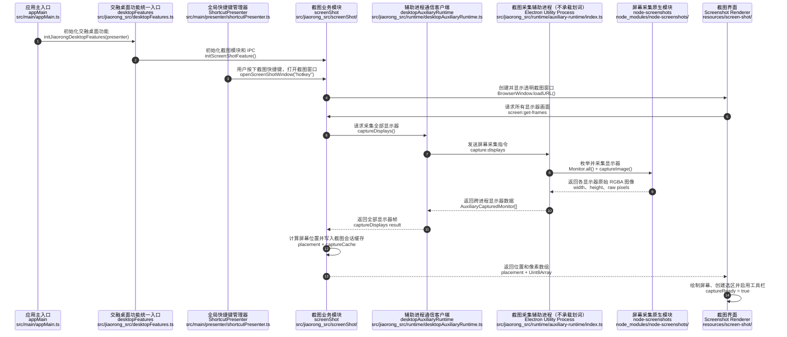
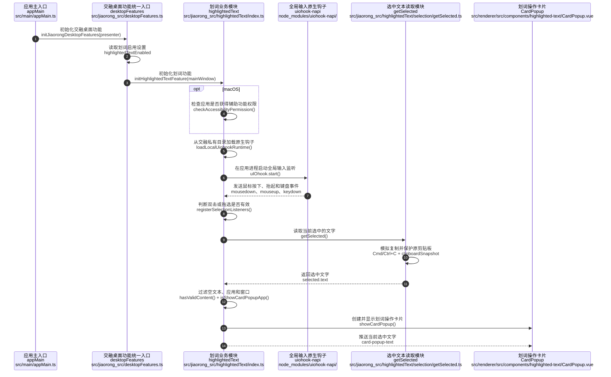

# 截图与划词当前架构及主进程接入说明

## 1. 当前结论

截图和划词的业务实现统一位于：

```text
src/jiaorong_src/
```

Electron 主进程目录 `src/main/` 不保存截图采集、划词监听、取词、OCR、钉图、截图窗口
或划词窗口的具体实现。

主进程目前只有两个必要接入点：

1. `src/main/appMain.ts`：调用一次统一初始化方法。
2. `src/main/presenter/shortcutPresenter.ts`：在统一快捷键生命周期中调用截图入口。

其中 `appMain.ts` 对截图和划词只包含：

```ts
import { initJiaorongDesktopFeatures } from '../jiaorong_src/desktopFeatures'
```

以及：

```ts
initJiaorongDesktopFeatures(activePresenter)
```

设置读取、划词开关监听、token 读取、截图模块初始化等代码均在
`src/jiaorong_src/desktopFeatures.ts` 中。

## 2. 当前目录结构

```text
src/
├── main/                                  # 开源 Electron 主进程
│   ├── appMain.ts                         # 一行私有能力初始化调用
│   └── presenter/
│       └── shortcutPresenter.ts           # 截图快捷键接入点
├── preload/                               # Renderer 安全 IPC 桥接
├── renderer/                              # 应用界面
├── shared/                                # 开源公共代码
└── jiaorong_src/                          # 交融私有代码
    ├── desktopFeatures.ts                 # 截图和划词统一初始化入口
    ├── 改动锚点说明.md
    ├── 截图与划词迁移方案.md
    ├── highlightedText/
    │   ├── index.ts                       # 划词功能公共入口
    │   ├── contracts/
    │   │   └── types.ts                   # 划词内部类型
    │   ├── input/
    │   │   ├── accessibility.ts           # macOS 辅助功能权限
    │   │   ├── registerSelectionListeners.ts
    │   │   └── uiohookRuntime.ts           # 应用进程内的原生钩子加载器
    │   ├── selection/
    │   │   ├── activeWindow.ts            # 当前前台窗口
    │   │   ├── clipboardSnapshot.ts       # 剪贴板保护
    │   │   ├── filterSelection.ts         # 应用和窗口过滤
    │   │   ├── getSelected.ts             # 获取选中文本
    │   │   └── nativeSelection.ts         # Windows UIA 模块
    │   └── windows/
    │       └── windowUtils.ts              # 坐标转换
    ├── screenShot/
    │   ├── index.ts                       # 截图功能公共入口
    │   ├── capture/
    │   │   ├── displayMetrics.ts          # 多显示器布局
    │   │   └── imageUtils.ts              # 图片格式转换
    │   ├── contracts/
    │   │   ├── ipc.ts                     # 截图 IPC 常量和类型
    │   │   └── types.ts                   # 截图内部类型
    │   ├── features/
    │   │   ├── index.ts                   # 截图后动作分发
    │   │   ├── ocr.ts                     # OCR
    │   │   ├── pin.ts                     # 钉图
    │   │   └── windowUtils.ts             # 结果窗口辅助
    │   ├── ipc/
    │   │   └── registerScreenshotIpc.ts   # 截图 IPC 注册
    │   ├── logging/
    │   │   └── runtimeLogger.ts            # 截图运行日志
    │   └── session/
    │       ├── captureCache.ts             # 截图会话缓存
    │       └── exportSelection.ts          # 选区底图导出
    └── runtime/
        ├── desktopAuxiliaryRuntime.ts      # 主进程侧辅助进程客户端
        └── auxiliary-runtime/
            ├── contracts.ts                # 跨进程通信协议
            └── index.ts                    # 独立 utility process 入口
```

## 3. 私有统一入口

统一入口文件：

```text
src/jiaorong_src/desktopFeatures.ts
```

对外只暴露：

```ts
initJiaorongDesktopFeatures(presenter)
```

该方法负责所有截图和划词启动编排。

### 3.1 划词初始化

统一入口内部负责：

- 读取 `highlightedTextEnabled`。
- 设置缺失时默认启用划词。
- 调用 `initHighlightedTextFeature()`。
- 设置关闭时调用 `destroyHighlightedTextFeature()`。
- 监听 `CONFIG_EVENTS.SETTING_CHANGED`。
- 设置发生变化时立即启用或停止划词。
- 捕获并记录划词初始化错误。

### 3.2 截图初始化

统一入口内部负责：

- 调用 `initScreenShotFeature()`。
- 从主窗口 `localStorage` 读取 `xkaitoken`。
- 将 token reader 注入截图模块。
- 从 ConfigPresenter 读取当前截图快捷键。
- 将 shortcut reader 注入截图模块。
- 捕获并记录 token 读取错误。

### 3.3 防止重复初始化

统一入口使用内部状态：

```ts
let initialized = false
```

确保：

- IPC handler 不会重复注册。
- 设置事件不会重复监听。
- 原生钩子不会因为重复初始化而重复启动。

## 4. 主进程改动数量

只统计 `src/main/` 中与截图和划词直接相关的当前代码。

### 4.1 `src/main/appMain.ts`

改动数量：

- 1 条 import。
- 1 次方法调用。

代码形式：

```ts
import { initJiaorongDesktopFeatures } from '../jiaorong_src/desktopFeatures'
```

```ts
const activePresenter = presenter
initJiaorongDesktopFeatures(activePresenter)
```

`appMain.ts` 中不再包含：

- `highlightedTextEnabled` 读取。
- 划词启用和关闭函数。
- 设置变化监听。
- 划词初始化错误处理。
- 截图 token 读取。
- 截图快捷键读取函数。
- `initScreenShotFeature()` 参数编排。

### 4.2 `src/main/presenter/shortcutPresenter.ts`

改动数量：

- 1 条 import。
- 1 次截图方法调用。

代码形式：

```ts
import { openScreenShotWindow } from '../../jiaorong_src/screenShot'
```

```ts
globalShortcut.register(this.shortcutKeys.Screenshot, () => {
  openScreenShotWindow('hotkey')
})
```

快捷键注册必须留在 ShortcutPresenter 的统一流程中，因为该 Presenter 负责：

- Electron `globalShortcut` 生命周期。
- 快捷键配置刷新。
- `unregisterAll()` 后重新注册全部系统快捷键。
- 快捷键注册失败日志。

如果截图模块自行注册全局快捷键，ShortcutPresenter 刷新快捷键时可能将其移除。
因此这里保留的是生命周期接入点，不是截图业务实现。

### 4.3 主进程总计

当前 `src/main/` 与截图和划词直接相关的接入总量：

| 文件 | import | 方法调用 | 业务实现 |
| --- | ---: | ---: | ---: |
| `appMain.ts` | 1 | 1 | 0 |
| `shortcutPresenter.ts` | 1 | 1 | 0 |
| 合计 | 2 | 2 | 0 |

主进程涉及两个文件、两条私有模块 import 和两次方法调用。

## 5. 为什么 AppMain 仍要保留一次调用

`initJiaorongDesktopFeatures()` 必须在以下条件成立后执行：

- Electron `app.whenReady()` 已完成。
- `lifecycleManager.start()` 已完成。
- Presenter 实例已经创建。
- 主窗口 Presenter 和 ConfigPresenter 已可用。

这些状态由 `appMain.ts` 掌握，因此 AppMain 只负责在正确时机调用统一入口。
具体功能逻辑全部由私有模块负责。

当前边界为：

```text
appMain
  → initJiaorongDesktopFeatures(activePresenter)
  → 私有模块完成全部截图和划词初始化
```

## 6. 截图当前运行链路

### 6.1 截图主链路时序图

这张图描述从应用初始化、用户触发截图、辅助进程采集屏幕，到截图界面拿到数据并启用工具栏的
完整过程。



截图链路的进程边界：

- `appMain` 只调用交融统一入口。
- 截图原始采集始终在 Utility Process。
- Utility Process 当前只承载 `node-screenshots` 屏幕采集，不承载任何平台的划词监听。
- 主进程侧的截图模块只负责窗口、IPC、位置计算和业务编排。
- 原始屏幕采集由 `node-screenshots` 在辅助进程完成。

### 6.2 快捷键入口

```text
Electron globalShortcut
  → ShortcutPresenter
  → openScreenShotWindow('hotkey')
  → jiaorong_src/screenShot
```

### 6.3 Renderer 入口

```text
Renderer
  → preload.openScreenShotWindow()
  → ipcRenderer.invoke('screen-shot:open')
  → screenShot IPC handler
  → openScreenShotWindow('ipc')
```

### 6.4 屏幕采集

```text
截图 Renderer 请求 screen:get-frames
  → screenShot.captureDisplayTiles()
  → desktopAuxiliaryRuntime.captureDisplays()
  → Electron utilityProcess
  → node-screenshots
  → 返回各显示器 RGBA tile
  → 主进程侧计算 placement 和会话缓存
  → preload 恢复 Uint8Array
  → Renderer 绘制截图界面
```

### 6.5 截图动作

截图模块统一处理：

- OCR。
- 钉图。
- 图片问答。
- 新图片问答。
- 截图总结。
- 表格提取。
- 解题。
- 图片写入剪贴板。
- 选区底图导出。

这些实现均位于 `src/jiaorong_src/screenShot/`。

## 7. 划词当前运行链路

划词业务实现和运行编排均位于 `src/jiaorong_src/highlightedText/`，但原生输入钩子的
运行位置按平台区分。

### 7.1 划词主链路时序图

这张图描述划词功能初始化、全局鼠标事件监听、选中文本读取和 CardPopup 显示过程。三个平台
使用相同的应用进程钩子链路，仅 macOS 额外检查辅助功能权限。



划词链路的进程边界：

- 划词状态机、文本读取、过滤和 CardPopup 编排全部位于 `jiaorong_src/highlightedText`。
- macOS、Windows 和 Linux 的 `uiohook-napi` 都在应用进程中运行。
- 钩子加载器和全部划词实现都位于 `jiaorong_src`，不放入 `src/main`。
- `appMain` 不包含划词实现，只调用统一初始化入口。

### 7.2 全平台划词链路

```text
initJiaorongDesktopFeatures()
  → 读取 highlightedTextEnabled
  → initHighlightedTextFeature()
  → macOS 检查 JiaorongAI 辅助功能权限
  → jiaorong_src/highlightedText/input/uiohookRuntime.ts
  → 在 Electron 应用进程中加载 uiohook-napi
  → registerSelectionListeners()
  → Windows UIA 或剪贴板模拟复制取词
  → 显示划词工具条
  → 执行复制、翻译等动作
```

统一在应用进程运行钩子可以减少平台差异。这里的“应用进程运行”不代表实现返回
`src/main`：加载器、监听状态机、取词和窗口逻辑仍全部位于 `src/jiaorong_src/highlightedText`。
`src/main/appMain.ts` 仍然只有统一入口调用。

划词关闭链路：

```text
CONFIG_EVENTS.SETTING_CHANGED
  → desktopFeatures.ts
  → destroyHighlightedTextFeature()
  → 关闭工具条和翻译窗口
  → 停止应用进程中的 hook
  → 清理事件监听
```

## 8. 独立辅助进程

辅助进程入口：

```text
src/jiaorong_src/runtime/auxiliary-runtime/index.ts
```

它负责加载截图原生模块：

```ts
require('node-screenshots')
```

辅助进程负责：

- 枚举显示器。
- 采集显示器原始 RGBA 数据。

全平台的 `uiohook-napi` 由以下私有加载器直接加载：

```text
src/jiaorong_src/highlightedText/input/uiohookRuntime.ts
```

加载器最终运行在应用主进程，但不会向 `src/main/` 放回划词实现。

主进程侧客户端：

```text
src/jiaorong_src/runtime/desktopAuxiliaryRuntime.ts
```

客户端负责：

- 启动 utility process。
- 请求和响应 ID 管理。
- 等待请求表管理。
- 原生 hook 事件转发。
- 辅助进程退出处理。
- 当前请求错误回传。
- 下一次调用时重新启动辅助进程。

## 9. Preload 当前改动

`src/preload/index.ts` 保留 renderer 与主进程间的安全 IPC 桥接。

它从私有目录导入截图 IPC 类型：

```ts
from '../jiaorong_src/screenShot/contracts/ipc'
```

preload 负责：

- 暴露截图和划词 API。
- 监听截图 session 事件。
- 调用截图 IPC。
- 将跨 IPC 的 Buffer-like 数据恢复为 `Uint8Array`。
- 保持截图页面 `window.api.useMain` 兼容。

preload 不加载：

- `uiohook-napi`。
- `node-screenshots`。
- Windows UIA selection 模块。

## 10. 构建配置

`electron.vite.config.ts` 将私有辅助进程作为独立入口构建：

```ts
desktopAuxiliaryRuntimeHost: resolve(
  'src/jiaorong_src/runtime/auxiliary-runtime/index.ts'
)
```

输出文件：

```text
out/main/desktopAuxiliaryRuntimeHost.js
```

`tsconfig.node.json` 包含：

```json
"src/jiaorong_src/**/*"
```

因此私有 Electron 模块参与正式 TypeScript 类型检查。

`electron-builder.yml` 继续解包：

```yaml
asarUnpack:
  - '**/node_modules/uiohook-napi/**/*.node'
  - '**/node_modules/uiohook-napi/prebuilds/**'
  - '**/node_modules/node-screenshots/**/*'
```

这是安装包加载原生模块所必需的配置。

## 11. 当前主进程仍承担的运行职责

源码位于私有目录不等于所有逻辑都运行在辅助进程。

Electron 主进程目前仍承担：

- 在所有平台装载和运行 `uiohook-napi`。
- 创建截图和划词 `BrowserWindow`。
- 注册 `ipcMain` handler。
- Electron `screen` 坐标换算。
- 接收辅助进程返回的 RGBA 数据。
- 多显示器 tile placement。
- 部分图片缩放和画布拼接。
- `nativeImage` 和系统剪贴板操作。
- 截图 session cache。
- OCR、钉图和图片动作编排。

这些代码均位于 `src/jiaorong_src/`，但由于使用 Electron 主进程 API，最终会被打包进
主进程 bundle。

已经物理隔离到独立进程的部分是：

- `node-screenshots`。
- 显示器原始截图采集。

全平台的原生输入 hook 不做物理进程隔离。这里优先保证划词可靠性和跨平台行为一致；通过
源码目录隔离保证划词实现不进入 `src/main/`，降低与开源主进程合并时的冲突。

## 12. 可继续降低主进程负载的方案

如果需要进一步降低主进程 CPU 和内存占用，可以继续将以下能力放入 utility process：

1. RGBA resize。
2. 多显示器画布合成。
3. 选区裁剪。
4. PNG/JPEG 编码。
5. OCR worker。

目标链路可以变成：

```text
辅助进程采集
  → 辅助进程合成和压缩
  → 主进程只接收压缩图片或选区图片
  → Renderer 展示
```

这样可以减少大尺寸 RGBA 数据在辅助进程、主进程和 Renderer 之间的复制。

## 13. 当前验证结果

当前架构已经通过：

- `pnpm run typecheck:node`
- `pnpm exec electron-vite build`
- 变更范围 Oxlint
- `pnpm run lint:architecture`
- `git diff --check`

构建能够生成：

```text
out/main/desktopAuxiliaryRuntimeHost.js
```

## 14. 当前边界检查

可以使用以下命令检查主进程是否重新引入原生模块：

```bash
rg "uiohook-napi|node-screenshots" src/main
```

正确结果应为空。这里检查的是公开主进程源码中没有直接引用原生模块；macOS 私有模块最终
仍会被打包到主进程 bundle。

检查原生模块加载位置：

```bash
rg "uiohook-napi|node-screenshots" src/jiaorong_src
```

直接 `require` 当前允许出现在：

```text
src/jiaorong_src/runtime/auxiliary-runtime/index.ts
src/jiaorong_src/highlightedText/input/uiohookRuntime.ts
```

前者承载截图采集，后者承载全平台应用进程内的输入钩子。

检查主进程接入点：

```bash
rg "jiaorong_src" src/main
```

当前应只包含：

```text
src/main/appMain.ts
src/main/presenter/shortcutPresenter.ts
```
